# ER Diagram — Lost & Found ICT

แผนภาพความสัมพันธ์ของฐานข้อมูล 14 ตาราง ใช้ความสัมพันธ์ **23 เส้น** ตามที่กำหนดในแผนออกแบบ
จัดกลุ่มตามตารางหลัก (item / user_account / claim / อื่น ๆ) · โครงสร้างตารางและคอลัมน์อ้างอิงจาก
[DATA_DICTIONARY.md](./DATA_DICTIONARY.md)

**ระดับหลักฐาน**
| ระดับ | ความหมาย |
|-------|----------|
| ✅ [จริง] | FK มีอยู่ในตารางจริงและโค้ดใน `src/js` เรียกใช้งาน |
| ⬜ [สันนิษฐาน] | FK สอดคล้องกับสเปก/คอมเมนต์ RPC และมีคอลัมน์ใน [schema.sql](schema.sql) แล้ว แต่ยังไม่มีโค้ดยืนยันหลักฐานเต็ม |
| ❓ ❓ [ต้องยืนยัน] | FK ยังไม่มีทั้งในโค้ด/โครง `schema.sql` จริง — ต้องยืนยันกับฐานข้อมูลจริง |

**ชนิด:** `1:N` = ฝั่งซ้าย 1 รายการ ต่อฝั่งขวาได้หลายรายการ · `1:1` = ของหนึ่งรายการ มีคู่ได้ 1 รายการ
**N:N: ไม่มี** — ทุกความสัมพันธ์ผ่าน FK แบบ 1:N หรือ 1:1 โดยตรง (ผู้ใช้กับสิ่งของสัมพันธ์กันทางอ้อมผ่าน `claim`)

---

## 1. Diagram เต็ม (Mermaid erDiagram)

```mermaid
erDiagram
    CATEGORY {
        uuid category_id PK
        text category_name
        boolean is_active
    }
    STORAGE_POINT {
        uuid storage_id PK
        text storage_name
        text room
        text description
    }
    USER_ACCOUNT {
        uuid user_id PK
        text email
        text full_name
        text phone_number
        text role
    }
    ITEM {
        char item_id PK "ITM-2026-0001"
        char reference_id "INV-2026-001"
        text item_name
        text status
        char category_id FK
        char current_storage_id FK
        text recorded_by FK
        char matched_item_id FK "self FK"
        timestamp created_at
        timestamp disposed_at
        timestamp deleted_at
    }
    ITEM_SECRET {
        char item_id PK, FK
        text defect_note
    }
    ITEM_MEDIA {
        uuid media_id PK
        char item_id FK
        text url
        text type
    }
    REPORT {
        uuid report_id PK
        char item_id FK
        uuid user_id FK
        text report_type "lost | found"
        text incident_location
        timestamp incident_datetime
    }
    ITEM_HISTORY_LOG {
        char log_id PK
        char item_id FK
        text status
        uuid changed_by FK
        char storage_point_id FK "มีใน schema.sql (MySQL DDL)"
        timestamp changed_at
    }
    NOTIFICATION {
        uuid notification_id PK
        uuid user_id FK
        char item_id FK "มีใน schema.sql (MySQL DDL)"
        char claim_id FK "มีใน schema.sql (MySQL DDL)"
        text type
        boolean is_read
    }
    CLAIM {
        char claim_id PK "CLM-24-0891"
        char item_id FK
        uuid user_id FK
        text status "pending | more_info | approved | rejected | completed"
        text claimant_name
        text reviewer_name
    }
    CLAIM_PROOF {
        uuid proof_id PK
        char claim_id FK
        text name
        text url
    }
    CLAIM_ACTIVITY_LOG {
        uuid log_id PK
        char claim_id FK
        text title
    }
    DISPOSAL {
        uuid disposal_id PK
        char item_id FK
        uuid user_id FK "ใน schema.sql คือ staff_id (MySQL)"
        text dispose_type "donate | destroy | other"
        timestamp disposed_at
    }
    HANDOVER {
        uuid handover_id PK
        char claim_id FK
        char item_id FK
        uuid staff_user_id FK "ใน schema.sql คือ staff_id (MySQL)"
        text recipient_name
        text staff_name
        jsonb proof_urls
    }

    CATEGORY ||--o{ ITEM : "categorized_as (item.category_id)"
    ITEM ||--|| ITEM_SECRET : "has_secret (item_secret.item_id)"
    ITEM ||--o{ ITEM_MEDIA : "has_media (item_media.item_id)"
    ITEM ||--o{ REPORT : "is_reported_in (report.item_id)"
    ITEM ||--o{ ITEM : "matched_with (item.matched_item_id)"
    ITEM ||--o{ CLAIM : "is_claimed_in (claim.item_id)"
    ITEM ||--o{ DISPOSAL : "is_disposed_in (disposal.item_id)"
    ITEM ||--o{ ITEM_HISTORY_LOG : "has_log (item_history_log.item_id)"
    ITEM ||--o{ HANDOVER : "handed_over (handover.item_id)"
    ITEM ||--o{ NOTIFICATION : "notifies_about (notification.item_id)"
    STORAGE_POINT ||--o{ ITEM : "stored_at (item.current_storage_id)"

    USER_ACCOUNT ||--o{ ITEM : "recorded_by (item.recorded_by)"
    USER_ACCOUNT ||--o{ REPORT : "files (report.user_id)"
    USER_ACCOUNT ||--o{ NOTIFICATION : "receives (notification.user_id)"
    USER_ACCOUNT ||--o{ CLAIM : "submits (claim.user_id)"
    USER_ACCOUNT ||--o{ DISPOSAL : "performs_disposal (disposal.user_id)"
    USER_ACCOUNT ||--o{ ITEM_HISTORY_LOG : "acts_in (item_history_log.changed_by)"
    USER_ACCOUNT ||--o{ HANDOVER : "performs_handover (handover.staff_user_id)"

    CLAIM ||--o{ CLAIM_PROOF : "has_proof (claim_proof.claim_id)"
    CLAIM ||--o{ HANDOVER : "results_in (handover.claim_id)"
    CLAIM ||--o{ CLAIM_ACTIVITY_LOG : "has_activity (claim_activity_log.claim_id)"
    CLAIM ||--o{ NOTIFICATION : "notifies_claim (notification.claim_id)"

    STORAGE_POINT ||--o{ ITEM_HISTORY_LOG : "logs_storage (item_history_log.storage_point_id)"
```

---

## 2. ตารางสรุป Relationship ทุกเส้น

### รอบตาราง item (ของที่พบ)

| # | ความสัมพันธ์ | ตาราง | ชนิด | FK (ฝั่ง N) | ระดับหลักฐาน | ความหมาย |
|---|-------------|-------|------|------------|--------------|----------|
| 1 | `categorized_as` | category → item | 1:N | `item.category_id` | ✅ [จริง] join `home.js:39` | หนึ่งหมวดหมู่มีของได้หลายชิ้น |
| 2 | `has_secret` | item → item_secret | 1:1 | `item_secret.item_id` | ⬜ [สันนิษฐาน] อ่านผ่าน RPC `get_staff_defect_note` เท่านั้น | ของแต่ละชิ้นมีข้อมูลลับ (defect_note) ได้ 1 รายการ |
| 3 | `has_media` | item → item_media | 1:N | `item_media.item_id` | ✅ [จริง] `.eq('item_id')` `staff-post-detail.js:194` | ของหนึ่งชิ้นมีรูปหรือไฟล์ได้หลายไฟล์ |
| 4 | `is_reported_in` | item → report | 1:N | `report.item_id` | ✅ [จริง] join ทุกหน้า `detail.js:117` | ของหนึ่งชิ้นอยู่ในรายงานได้หลายฉบับ |
| 5 | `matched_with` | item → item (self) | 1:N | `item.matched_item_id` | ✅ [จริง] อ่าน `detail.js:229` (ยังไม่มีโค้ดเขียนค่านี้ — F-05) | จับคู่ของกับของด้วยกันเอง (ความสัมพันธ์กับตัวเอง) |
| 6 | `is_claimed_in` | item → claim | 1:N | `claim.item_id` | ✅ [จริง] join `staff-verify-detail.js:77` | ของหนึ่งชิ้นมีคำขอรับคืนได้หลายคำขอ |
| 7 | `is_disposed_in` | item → disposal | 1:N | `disposal.item_id` | ⬜ [สันนิษฐาน] เขียนผ่าน RPC `staff_dispose_item` | ของหนึ่งชิ้นมีบันทึกการจำหน่ายออกได้ |
| 8 | `has_log` | item → item_history_log | 1:N | `item_history_log.item_id` | ⬜ [สันนิษฐาน] ยังไม่มีโค้ดเรียก (KP-08) | ของหนึ่งชิ้นมีประวัติการเปลี่ยนแปลงหลายรายการ |
| 9 | `handed_over` | item → handover | 1:N | `handover.item_id` | ✅ [จริง] join `staff-dashboard.js:106` | ของหนึ่งชิ้นมีบันทึกการส่งมอบได้ |
| 10 | `notifies_about` | item → notification | 1:N | `notification.item_id` | ⬜ [สันนิษฐาน] มีคอลัมน์ใน schema.sql แล้ว แต่ยังไม่มีโค้ดเขียนจริง (Q-L) | ของหนึ่งชิ้นเป็นหัวข้อของการแจ้งเตือนได้หลายครั้ง |
| 11 | `stored_at` | storage_point → item | 1:N | `item.current_storage_id` | ✅ [จริง] join `home.js:40` | จุดเก็บหนึ่งแห่งเก็บของได้หลายชิ้น |

### รอบตาราง user_account (ผู้ใช้)

| # | ความสัมพันธ์ | ตาราง | ชนิด | FK (ฝั่ง N) | ระดับหลักฐาน | ความหมาย |
|---|-------------|-------|------|------------|--------------|----------|
| 12 | `recorded_by` | user_account → item | 1:N | `item.recorded_by` | ⬜ [สันนิษฐาน] RPC รับ `p_staff_id` | ผู้ใช้หนึ่งคนบันทึกของได้หลายชิ้น |
| 13 | `files` | user_account → report | 1:N | `report.user_id` | ✅ [จริง] join `browse.js:87` | ผู้ใช้หนึ่งคนยื่นรายงานได้หลายฉบับ |
| 14 | `receives` | user_account → notification | 1:N | `notification.user_id` | ⬜ [สันนิษฐาน] ตารางยังไม่มีโค้ดเรียก | ผู้ใช้หนึ่งคนได้รับการแจ้งเตือนหลายครั้ง |
| 15 | `submits` | user_account → claim | 1:N | `claim.user_id` | ✅ [จริง] `.eq('user_id')` `activity.js:157` | ผู้ใช้หนึ่งคนยื่นคำขอรับคืนได้หลายคำขอ |
| 16 | `performs_disposal` | user_account → disposal | 1:N | `disposal.staff_id` | ⬜ [สันนิษฐาน] มีคอลัมน์ใน schema.sql แล้ว (ชื่อ `staff_id`) แต่ยังไม่มีโค้ดเขียนจริง | ผู้ใช้หนึ่งคนทำรายการจำหน่ายได้หลายรายการ |
| 17 | `acts_in` | user_account → item_history_log | 1:N | `item_history_log.changed_by` | ⬜ [สันนิษฐาน] ตาม requirements 7.2 | ผู้ใช้หนึ่งคนเป็นผู้กระทำในหลายบันทึกประวัติ |
| 18 | `performs_handover` | user_account → handover | 1:N | `handover.staff_id` | ⬜ [สันนิษฐาน] มีคอลัมน์ใน schema.sql แล้ว (ชื่อ `staff_id`) แต่โค้ดเก็บ `staff_name` เป็นข้อความ | ผู้ใช้หนึ่งคนทำการส่งมอบได้หลายครั้ง |

### รอบตาราง claim (คำขอรับคืน)

| # | ความสัมพันธ์ | ตาราง | ชนิด | FK (ฝั่ง N) | ระดับหลักฐาน | ความหมาย |
|---|-------------|-------|------|------------|--------------|----------|
| 19 | `has_proof` | claim → claim_proof | 1:N | `claim_proof.claim_id` | ✅ [จริง] `.eq('claim_id')` `staff-verify-detail.js:90` | หนึ่งคำขอแนบหลักฐานได้หลายไฟล์ |
| 20 | `results_in` | claim → handover | 1:N | `handover.claim_id` | ⬜ [สันนิษฐาน] RPC `record_handover` รับ `p_claim_id` | หนึ่งคำขอนำไปสู่การส่งมอบได้ |
| 21 | `has_activity` | claim → claim_activity_log | 1:N | `claim_activity_log.claim_id` | ✅ [จริง] `.eq('claim_id')` `staff-verify-detail.js:104` | หนึ่งคำขอมีบันทึกความเคลื่อนไหวหลายรายการ |
| 22 | `notifies_claim` | claim → notification | 1:N | `notification.claim_id` | ⬜ [สันนิษฐาน] มีคอลัมน์ใน schema.sql แล้ว แต่ยังไม่มีโค้ดเขียนจริง (Q-L) | หนึ่งคำขอทำให้เกิดการแจ้งเตือนหลายครั้ง |

### อื่น ๆ

| # | ความสัมพันธ์ | ตาราง | ชนิด | FK (ฝั่ง N) | ระดับหลักฐาน | ความหมาย |
|---|-------------|-------|------|------------|--------------|----------|
| 23 | `logs_storage` | storage_point → item_history_log | 1:N | `item_history_log.storage_point_id` | ⬜ [สันนิษฐาน] มีคอลัมน์ใน schema.sql แล้ว แต่ยังไม่มีโค้ดเรียก (KP-08) | จุดเก็บหนึ่งแห่งปรากฏในหลายบันทึกประวัติ |

---

## สรุปภาพรวมการไหลของข้อมูล

ผู้ใช้บันทึก `item` แล้ว `item` ถูกจัดหมวด (`category`) เก็บที่ `storage_point`
และมีประวัติใน `item_history_log` เมื่อมีคนมาขอรับ ก็เกิด `claim` พร้อมหลักฐาน (`claim_proof`)
และบันทึกความเคลื่อนไหว (`claim_activity_log`) หากอนุมัติจะไปสู่ `handover`
ส่วนของที่ไม่มีคนรับจะถูกจำหน่ายออกใน `disposal` และทุกขั้นตอนมี `notification` แจ้งผู้ใช้

## หมายเหตุ FK ที่กำกับ `⬜ [สันนิษฐาน]`

คอลัมน์ FK ของความสัมพันธ์ที่กำกับ `⬜ [สันนิษฐาน]` มีอยู่แล้วใน [schema.sql](./schema.sql) (DDL ร่าง MySQL 8):
`notification.item_id` · `notification.claim_id` · `disposal.staff_id` · `handover.staff_id` ·
`item_history_log.storage_point_id` — แต่ยังไม่มีโค้ดใน `src/js` เขียนค่าจริง (notification/item_history_log ยังไม่ถูกเรียก)
และชื่อคอลัมน์ของ disposal/handover เป็น `staff_id` (ข้อมูลตามโค้ดจริงเก็บเป็นข้อความ `staff_name`)
ต้องยืนยันกับโครงสร้างฐานข้อมูลจริงก่อนใช้งาน (ดู DATA_DICTIONARY หัวข้อ 8)