# Project Database

## คู่มือการใช้งานระบบแจ้งและติดตามของหายในคณะ Lost & Found ICT

### **ชื่อกลุ่ม:** Jellybee

### จัดทำโดย

1. 68023245 นางสาวนพวรรณ ก้องพนาไพรสณฑ์
2. 68026394 นางสาวชนิกานต์ แก้ววงค์เขียว

### เสนออาจารย์

ดร.ณัฐพล หาญสมุทร

### รายวิชา

พื้นฐานของระบบฐานข้อมูล

**สาขาวิศวกรรมซอฟต์แวร์**  
**คณะเทคโนโลยีสารสนเทศและการสื่อสาร มหาวิทยาลัยพะเยา**  
**ภาคเรียนที่ 1 ปีการศึกษา 2569**


## 1. คำอธิบายเว็บ Lost & Found ICT

**Lost & Found ICT System** เป็นระบบแจ้งและติดตามของหายภายในคณะ ที่ถูกพัฒนาขึ้นเพื่อเป็นศูนย์กลางในการบริหารจัดการข้อมูลสิ่งของสูญหายและสิ่งของที่ถูกพบ โดยเชื่อมโยงการทำงานระหว่างผู้ทำของหาย ผู้พบเห็นสิ่งของ และเจ้าหน้าที่ผู้ดูแล ผ่านระบบออนไลน์ที่สามารถเข้าถึงได้สะดวก

ระบบรองรับการบันทึกข้อมูลสิ่งของพร้อมรูปภาพ รายละเอียด สถานที่ และวันเวลาที่พบหรือสูญหาย รวมถึงสามารถค้นหาข้อมูลตามหมวดหมู่หรือคำสำคัญได้อย่างมีประสิทธิภาพ ช่วยลดปัญหาการกระจายข้อมูลหลายช่องทาง เพิ่มความสะดวกในการติดตามสถานะ และสนับสนุนกระบวนการยืนยันความเป็นเจ้าของอย่างเป็นระบบ

นอกจากนี้ ระบบยังช่วยลดภาระงานของเจ้าหน้าที่ในการจัดเก็บและติดตามข้อมูล เพิ่มโอกาสในการส่งคืนทรัพย์สินให้แก่เจ้าของได้อย่างรวดเร็วและถูกต้อง พร้อมยกระดับประสิทธิภาพการบริหารจัดการของหายในคณะให้มีความทันสมัย โปร่งใส และตรวจสอบได้


## 2. เทคโนโลยีที่ใช้
ระบบ Lost & Found ICT พัฒนาด้วยเทคโนโลยี Web เพื่อรองรับการใช้งานที่รวดเร็ว มีประสิทธิภาพ และสามารถขยายระบบในอนาคตได้

- HTML
- CSS
- JavaScript
- Node.js
- Vite
- Supabase (มี package `@supabase`)
- PostCSS
- Git / GitHub

### Frontend
- **HTML** สำหรับโครงสร้างและเนื้อหาของหน้าเว็บ
- **CSS** สำหรับการออกแบบและตกแต่งส่วนติดต่อผู้ใช้งาน
- **JavaScript** สำหรับจัดการการทำงานแบบโต้ตอบ และเป็นตัวกลางในการเชื่อมต่อข้อมูลระหว่างผู้ใช้กับระบบ

### Build Tools
- **Vite** สำหรับพัฒนาและ Build โปรเจกต์ให้มีประสิทธิภาพสูง
- **PostCSS** สำหรับจัดการและปรับปรุงการทำงานของ CSS

### Backend Service
- **Supabase** สำหรับจัดการฐานข้อมูล การยืนยันตัวตน และการจัดเก็บข้อมูลภายในระบบ

### Development Tools
- **Node.js** สำหรับจัดการส่วนประกอบที่โปรแกรมต้องใช้ และสภาพแวดล้อมในการพัฒนา
- **npm** สำหรับบริหารจัดการ Packages ของโปรเจกต์
- **Git** สำหรับควบคุมเวอร์ชันของซอร์สโค้ด
- **GitHub** สำหรับจัดเก็บและบริหารจัดการ Repository

### User Interface Features
- Responsive Web Design (RWD) — รองรับการแสดงผลบนอุปกรณ์และขนาดหน้าจอที่แตกต่างกัน
- Form Validation — ตรวจสอบความถูกต้องของข้อมูลที่ผู้ใช้กรอก
- Dynamic Content Rendering — แสดงและอัปเดตเนื้อหาบนหน้าเว็บแบบไดนามิก
- Real-time Data Management ผ่าน Supabase — จัดการและอัปเดตข้อมูลแบบเรียลไทม์ผ่าน Supabase


## 3. ฟีเจอร์หลัก ผู้ใช้ / เจ้าหน้าที่

### ระบบจัดการบัญชีผู้ใช้
- สมัครสมาชิก (Register)
- เข้าสู่ระบบ (Login)
- ลืมรหัสผ่าน (Forgot Password)
- จัดการข้อมูลโปรไฟล์ส่วนตัว

### ระบบแจ้งของหาย
- แจ้งรายการสิ่งของสูญหาย
- ระบุรายละเอียดสิ่งของ
- ระบุสถานที่และเวลาที่สูญหาย
- แนบรูปภาพประกอบการแจ้ง

### ระบบแจ้งของที่พบ
- บันทึกข้อมูลสิ่งของที่พบ
- แสดงรายละเอียดและตำแหน่งที่พบ
- จัดเก็บข้อมูลเข้าสู่ระบบกลาง

### ระบบค้นหาและติดตาม
- ค้นหารายการของหายและของที่พบ
- เรียกดูรายการทั้งหมด
- กรองข้อมูลตามหมวดหมู่
- ดูรายละเอียดสิ่งของแต่ละรายการ

### ระบบขอรับสิ่งของคืน (Claim)
- ยื่นคำร้องขอรับสิ่งของคืน
- ตรวจสอบข้อมูลผู้ขอรับคืน
- ติดตามสถานะคำร้อง

### ระบบประวัติการดำเนินงาน
- แสดงประวัติการแจ้งของหาย
- แสดงประวัติการแจ้งของที่พบ
- ติดตามกิจกรรมต่าง ๆ ในระบบ

### ระบบสำหรับเจ้าหน้าที่
- แดชบอร์ดสรุปข้อมูลภาพรวม
- ตรวจสอบคำร้องขอรับสิ่งของคืน
- ตรวจสอบรายละเอียดการยืนยันตัวตน
- เพิ่มรายการสิ่งของเข้าสู่คลัง
- จัดการข้อมูลสิ่งของคงค้าง
- จัดการกระบวนการส่งมอบทรัพย์สิน
- ติดตามรายการที่เกินระยะเวลารับคืน

### ระบบยืนยันและตรวจสอบ
- ยืนยันสิทธิ์ความเป็นเจ้าของสิ่งของ
- ตรวจสอบหลักฐานประกอบการขอรับคืน
- ลดความผิดพลาดในการส่งมอบทรัพย์สิน

### Responsive Design
- รองรับการใช้งานบนคอมพิวเตอร์
- รองรับแท็บเล็ต
- รองรับสมาร์ตโฟน
  

## 4. วิธีการติดตั้งและรันระบบ
### Prerequisites
ตรวจสอบให้แน่ใจก่อนว่าได้ติดตั้งโปรแกรมต่อไปนี้เรียบร้อยแล้ว

- Node.js (v18 ขึ้นไป)
- npm (มาพร้อมกับ Node.js)
- Git
- Web Browser เช่น Google Chrome หรือ Microsoft Edge


### 1. Clone Repository

ดาวน์โหลดซอร์สโค้ดจาก GitHub

### 2. Install Dependencies

ติดตั้ง Packages ที่จำเป็นต้องใช้

```bash
npm install
```

### 3. Configure Environment Variables
สร้างไฟล์ .env และกำหนดค่าการเชื่อมต่อข้อมูล Supabase

```bash
VITE_SUPABASE_URL=[https://abcdefghijk.supabase.co](https://abcdefghijk.supabase.co)
VITE_SUPABASE_ANON_KEY=your_anon_key
```

### 4. Run Development Server
เริ่มรันระบบในโหมดพัฒนา
```bash
npm run dev
```
### 5. Build Project for Production
สร้างไฟล์สำหรับนำระบบขึ้นใช้งานจริง
```bash
npm run build
```
### 6. Preview Production Build
ทดสอบไฟล์ Build บนเครื่องก่อนขึ้น Server
```bash
npm run preview
```

### Supabase Configuration


### 1. สร้างโปรเจกต์ Supabase

1. เข้าเว็บไซต์ [supabase.com](https://supabase.com)
2. สมัครสมาชิกหรือเข้าสู่ระบบ
3. กดปุ่ม **New Project**
4. กรอกข้อมูลดังนี้:
   - **Project Name:** `lost-found-ict`
   - **Database Password:** ตั้งรหัสผ่านฐานข้อมูล
   - **Region:** เลือกภูมิภาคที่ใกล้ที่สุด
5. กด **Create Project**
6. รอประมาณ 1-2 นาทีจนระบบสร้างฐานข้อมูลเสร็จเรียบร้อย

### 2. คัดลอก Project URL และ API Key

ไปที่

1. Project Settings
2. API

คัดลอกค่า

1. Project URL
2. Anon Public Key

**ตัวอย่าง:**

```text
1  Project URL:
2  [https://abcdefghijk.supabase.co](https://abcdefghijk.supabase.co)
3  
4  Anon Key:
5  eyJhY2lk...
```

### 3. สร้างไฟล์ Environment
สร้างไฟล์ .env

```bash
VITE_SUPABASE_URL=[https://abcdefghijk.supabase.co](https://abcdefghijk.supabase.co)
VITE_SUPABASE_ANON_KEY=your_anon_key
```

### 4. ติดตั้ง Supabase Client
เปิด Terminal ภายในโฟลเดอร์

```bash
npm install @supabase/supabase-js
```

### 5. สร้างไฟล์เชื่อมต่อ Supabase
สร้างไฟล์
src/js/supabase.js

```bash
import { createClient } from '@supabase/supabase-js';

const supabaseUrl = import.meta.env.VITE_SUPABASE_URL;
const supabaseKey = import.meta.env.VITE_SUPABASE_ANON_KEY;

export const supabase = createClient(
  supabaseUrl,
  supabaseKey
);
```
### 6. สร้างฐานข้อมูล
ไปที่
เข้าสู่เมนู **SQL Editor** แล้วรันคำสั่งเพื่อสร้างตารางดังต่อไปนี้:

* **ตาราง `user_account`**: เกี่ยวกับข้อมูลผู้ใช้งาน
* **ตาราง `category`**: เกี่ยวกับหมวดหมู่ของของ
* **ตาราง `storage_point`**: เกี่ยวกับจุดเก็บของ
* **ตาราง `item`**: เกี่ยวกับข้อมูลของที่หายและของที่พบ
* **ตาราง `report`**: เกี่ยวกับรายงานของ/ของที่พบ
* **ตาราง `claim`**: เกี่ยวกับคำขอรับของคืน
* **ตาราง `notification`**: เกี่ยวกับข้อมูลการแจ้งเตือนผู้ใช้งาน
* **ตาราง `item_history_log`**: เกี่ยวกับประวัติการเปลี่ยนแปลงข้อมูลของ

### 7. เปิดใช้งาน Authentication
ไปที่
1. Authentication
2. Providers

 เปิด
1. Email Provider

จะแสดงระบบฟีเจอร์
* Register
* Login
* Reset Password

สำหรับหน้า
```bash
1. `login.html`
2. `register.html`
3. `forgotpassword.html`
```

### 8. เปิดใช้งาน Storage
ไปที่
1. Storage
2. New Bucket

สร้าง Bucket
1. `lost-items`

กำหนด
1. Public = Enabled

ใช้เก็บ
* รูปของหาย
* รูปหลักฐาน
* รูปโปรไฟล์


### 9. RLS (Row Level Security)
เปิด
1. Authentication
2. Required

และเปิด
```bash
Enable Row Level Security
```
สำหรับทุกตาราง

### ตัวอย่างคำสั่ง SQL สำหรับตั้งค่า
```sql
CREATE POLICY "Users can read all items"
ON lost_items
FOR SELECT
USING (true);
```
```sql
CREATE POLICY "Users can create items"
ON lost_items
FOR INSERT
TO authenticated
WITH CHECK (true);
```

### 10. Run Project

เริ่มต้นทำการรันระบบ:

```bash
npm run dev
```
ระบบจะเปิดใช้งานที่
```bash
http://localhost:5173
```


## 5. คู่มือการใช้งานระบบสำหรับผู้ใช้

## 1. การเข้าสู่ระบบ

เมื่อผู้ใช้งานเข้าสู่หน้าแรกของระบบ จะพบหน้าจอสำหรับเข้าสู่ระบบ ดังรูป ผู้ใช้งานสามารถดำเนินการได้ตามขั้นตอนดังนี้

1. กรอกอีเมลที่ใช้สำหรับลงทะเบียนบัญชีผู้ใช้ในช่อง **อีเมล**
2. กรอกรหัสผ่านในช่อง **รหัสผ่าน**
3. ตรวจสอบความถูกต้องของข้อมูลที่กรอก
4. คลิกปุ่ม **เข้าสู่ระบบ**
5. หากข้อมูลถูกต้อง ระบบจะนำผู้ใช้งานเข้าสู่หน้าหลักของระบบ

หมายเหตุ: หากยังไม่มีบัญชีผู้ใช้ สามารถเลือกเมนู **ลงทะเบียน** เพื่อสร้างบัญชีใหม่ได้

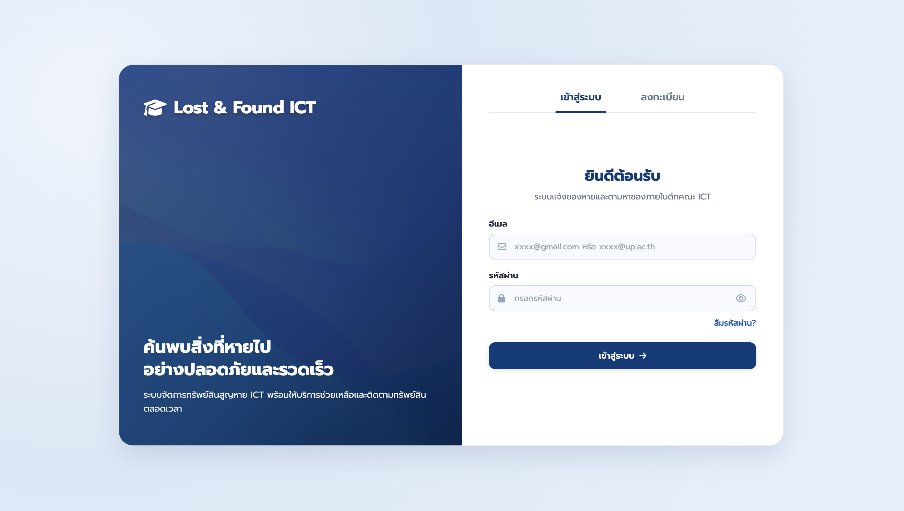

## 2. การลงทะเบียนผู้ใช้งานใหม่

สำหรับผู้ใช้งานที่ยังไม่มีบัญชี สามารถสมัครสมาชิกเพื่อเข้าใช้งานระบบได้ โดยมีขั้นตอนดังนี้

1. เลือกแท็บ **ลงทะเบียน**
2. กรอกข้อมูลในแบบฟอร์มให้ครบถ้วน ประกอบด้วย
   - ชื่อ - นามสกุล
   - อีเมล
   - รหัสผ่าน
   - ยืนยันรหัสผ่าน
3. กำหนดรหัสผ่านให้มีความยาวอย่างน้อย 8 ตัวอักษร และประกอบด้วยตัวอักษรภาษาอังกฤษและตัวเลข
4. กรอกรหัสผ่านยืนยันให้ตรงกับรหัสผ่านที่ตั้งไว้
5. คลิกปุ่ม **ลงทะเบียน**
6. เมื่อระบบบันทึกข้อมูลสำเร็จ ผู้ใช้งานสามารถใช้บัญชีที่สร้างขึ้นเพื่อเข้าสู่ระบบได้ทันที

หมายเหตุ: อีเมลที่ใช้ลงทะเบียนต้องไม่ซ้ำกับบัญชีผู้ใช้อื่นในระบบ

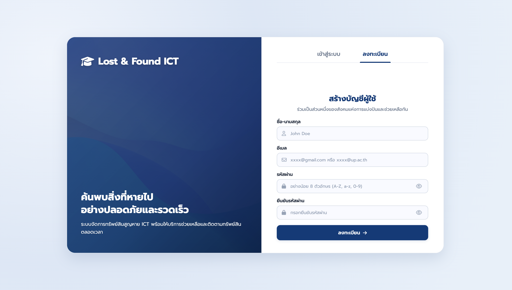

## 3. การกู้คืนรหัสผ่าน

ในกรณีที่ผู้ใช้งานลืมรหัสผ่าน สามารถขอรีเซ็ตรหัสผ่านได้ผ่านระบบ โดยดำเนินการดังนี้

1. คลิกเมนู **ลืมรหัสผ่าน ?** จากหน้าเข้าสู่ระบบ
2. ระบบจะแสดงหน้าสำหรับกู้คืนรหัสผ่าน
3. กรอกอีเมลที่ใช้ลงทะเบียนบัญชีผู้ใช้
4. คลิกปุ่ม **ส่งลิงก์กู้คืนรหัสผ่าน**
5. ระบบจะส่งลิงก์สำหรับรีเซ็ตรหัสผ่านไปยังอีเมลที่ระบุ
6. เปิดอีเมลและคลิกลิงก์ที่ได้รับ
7. ดำเนินการตั้งรหัสผ่านใหม่ตามขั้นตอนที่ระบบกำหนด
8. หลังจากเปลี่ยนรหัสผ่านสำเร็จ สามารถเข้าสู่ระบบด้วยรหัสผ่านใหม่ได้ทันที

หมายเหตุ: ควรตรวจสอบกล่องจดหมายขาเข้า (Inbox) และกล่องจดหมายขยะ (Spam/Junk Mail) หากไม่พบอีเมลกู้คืนรหัสผ่าน

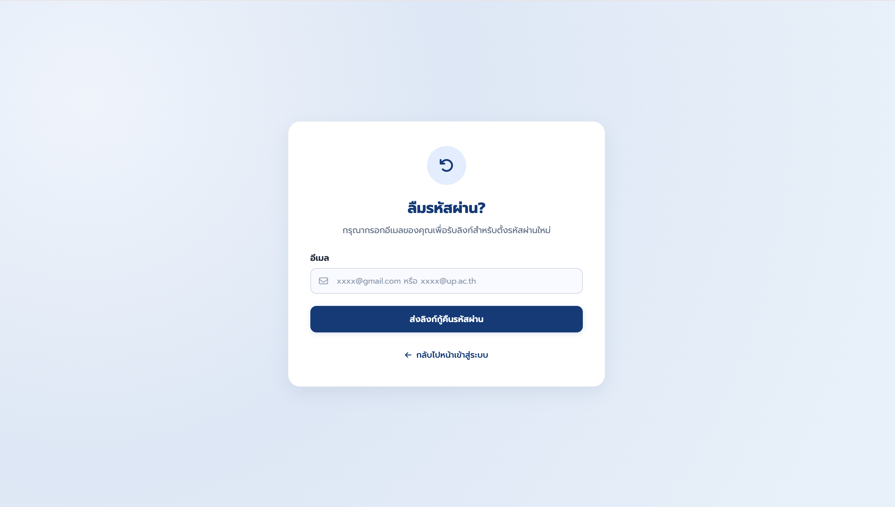

## 4. หน้าหลักของระบบ

เมื่อผู้ใช้งานเข้าสู่ระบบสำเร็จ ระบบจะแสดงหน้าหลัก (Home) ซึ่งเป็นศูนย์กลางสำหรับค้นหารายการสิ่งของสูญหายและติดตามประกาศต่าง ๆ ภายในระบบ

หน้าหลักประกอบด้วยส่วนสำคัญ ดังนี้

- แถบค้นหา สำหรับค้นหารายการสิ่งของที่ต้องการ
- ปุ่ม **โพสต์** สำหรับสร้างประกาศแจ้งของหายหรือแจ้งพบของ
- เมนู **My Activity** สำหรับติดตามรายการประกาศและกิจกรรมของตนเอง
- เมนู **Profile** สำหรับจัดการข้อมูลบัญชีผู้ใช้
- ส่วนแสดงสถิติการใช้งาน เช่น จำนวนรายการที่แจ้งในวันนี้ รายการส่งคืนสำเร็จ และรายการที่ยังเปิดอยู่
- ส่วนแสดงรายการล่าสุดที่ถูกประกาศในระบบ
- คำแนะนำขั้นตอนการใช้งานระบบ

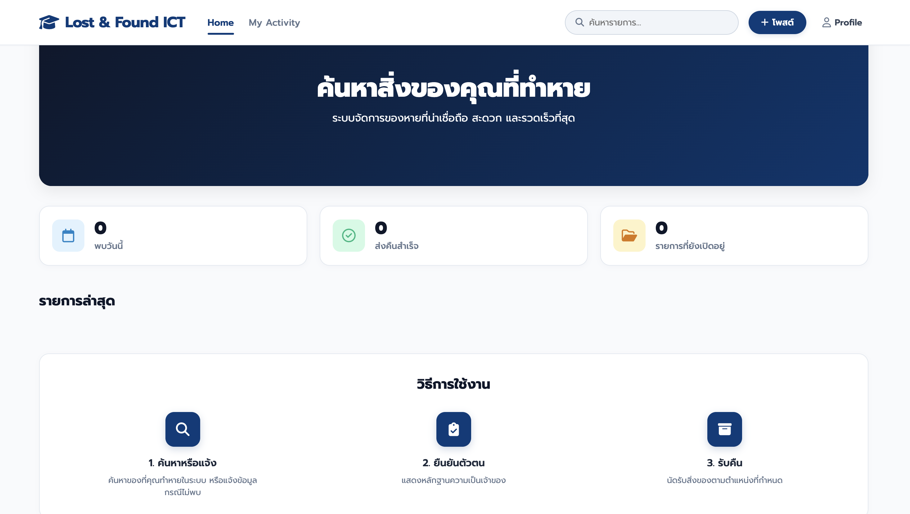

## 5. การสร้างประกาศแจ้งของหายหรือแจ้งพบของ

เมื่อผู้ใช้งานต้องการสร้างประกาศใหม่ สามารถคลิกปุ่ม **โพสต์** ที่มุมบนขวาของหน้าจอ ระบบจะนำเข้าสู่หน้าสร้างประกาศ ซึ่งแบ่งออกเป็น 3 ขั้นตอน ได้แก่

1. รายละเอียดสิ่งของ
2. สถานที่และเวลา
3. รูปภาพ

### 5.1 ขั้นตอนที่ 1 รายละเอียดสิ่งของ

ในขั้นตอนแรก ผู้ใช้งานต้องระบุข้อมูลพื้นฐานของสิ่งของที่ต้องการแจ้ง โดยมีรายละเอียดดังนี้

1. เลือกประเภทการแจ้ง
   - **แจ้งของหาย** สำหรับกรณีที่ทรัพย์สินสูญหาย
   - **แจ้งพบของ** สำหรับกรณีที่พบทรัพย์สินของผู้อื่น
2. กรอกชื่อสิ่งของ
   - ตัวอย่างเช่น กระเป๋าสตางค์สีดำ, โทรศัพท์ iPhone 13, กุญแจรถยนต์ เป็นต้น
3. เลือกหมวดหมู่ของสิ่งของ
   - เช่น อุปกรณ์อิเล็กทรอนิกส์
   - เอกสารสำคัญ
   - เครื่องใช้ส่วนตัว
   - อื่น ๆ ตามที่ระบบกำหนด
4. กรอกรายละเอียดเพิ่มเติม
   - ระบุลักษณะเด่น สี ยี่ห้อ รุ่น หรือข้อมูลสำคัญอื่น ๆ ที่ช่วยในการระบุสิ่งของ
5. เมื่อกรอกข้อมูลครบถ้วนแล้ว คลิกปุ่ม **ถัดไป** เพื่อไปยังขั้นตอนถัดไป

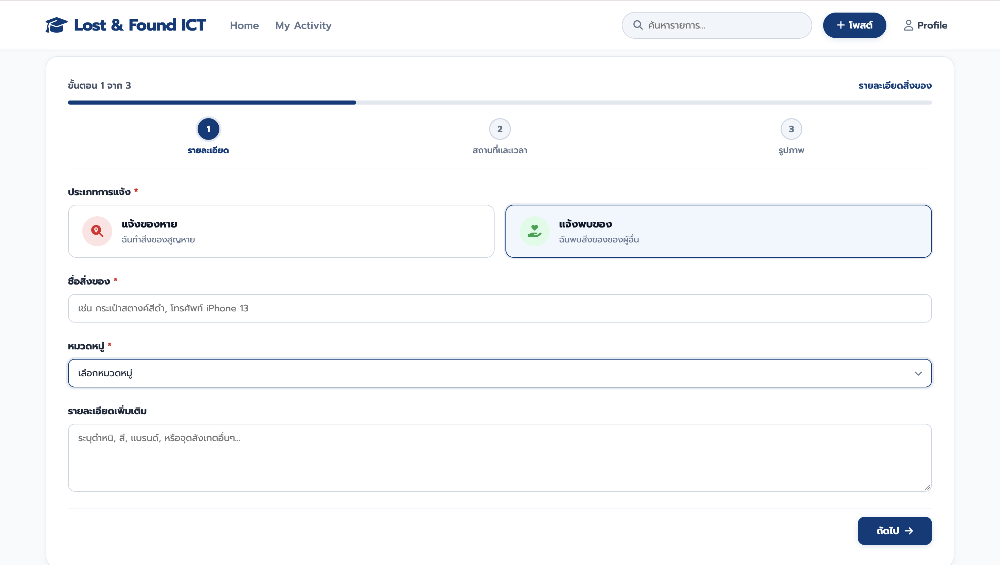

### 5.2 ขั้นตอนที่ 2 ระบุสถานที่และเวลา

หลังจากกรอกรายละเอียดสิ่งของเรียบร้อยแล้ว ระบบจะแสดงหน้าสำหรับระบุข้อมูลสถานที่และเวลาที่เกี่ยวข้องกับเหตุการณ์

ผู้ใช้งานต้องกรอกข้อมูลดังต่อไปนี้

1. เลือกสถานที่ที่เกิดเหตุหรือสถานที่พบสิ่งของ
2. ระบุวันที่เกิดเหตุ
3. ระบุเวลาที่คาดว่าเกิดเหตุหรือเวลาที่พบสิ่งของ
4. ตรวจสอบความถูกต้องของข้อมูล

เมื่อกรอกข้อมูลครบถ้วนแล้ว ให้คลิกปุ่ม **ถัดไป** เพื่อดำเนินการไปยังขั้นตอนการอัปโหลดรูปภาพ

หากต้องการแก้ไขข้อมูลในขั้นตอนก่อนหน้า สามารถคลิกปุ่ม **ย้อนกลับ** ได้

หมายเหตุ: เพื่อเพิ่มโอกาสในการค้นหาหรือจับคู่ข้อมูลได้อย่างถูกต้อง ผู้ใช้งานควรกรอกข้อมูลรายละเอียด สถานที่ และเวลาที่เกี่ยวข้องให้ครบถ้วนและถูกต้องมากที่สุด เนื่องจากข้อมูลดังกล่าวจะช่วยให้ผู้ใช้งานรายอื่นสามารถตรวจสอบและติดต่อขอรับคืนสิ่งของได้ง่ายขึ้น

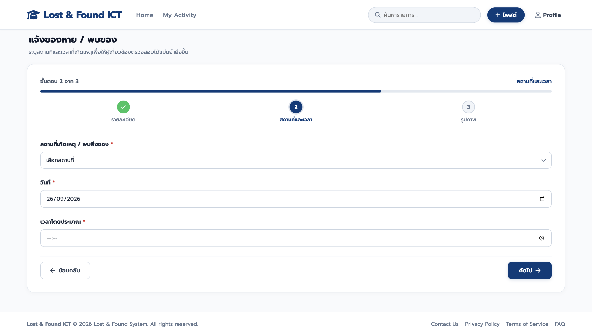

### 5.3 ขั้นตอนที่ 3 อัปโหลดรูปภาพและยืนยันการโพสต์

ในขั้นตอนสุดท้าย ผู้ใช้งานจะต้องอัปโหลดรูปภาพที่เกี่ยวข้องกับสิ่งของ เพื่อช่วยให้ผู้อื่นสามารถตรวจสอบและระบุสิ่งของได้อย่างถูกต้อง

**การอัปโหลดรูปภาพสิ่งของ**

1. คลิกปุ่ม **เลือกรูปภาพ**
2. เลือกไฟล์รูปภาพจากอุปกรณ์ของผู้ใช้งาน
3. ระบบรองรับไฟล์ประเภท PNG, JPG และ JPEG
4. สามารถอัปโหลดรูปภาพได้สูงสุด 5 รูป
5. ควรเลือกรูปภาพที่แสดงลักษณะของสิ่งของได้อย่างชัดเจน

**การอัปโหลดรูปยืนยันเฉพาะ**

ระบบมีส่วนสำหรับ รูปยืนยันเฉพาะ ซึ่งเป็นข้อมูลที่ไม่เปิดเผยต่อผู้ใช้งานทั่วไป โดยมีวัตถุประสงค์เพื่อใช้ในการตรวจสอบความเป็นเจ้าของสิ่งของ

1. คลิกปุ่ม **เลือกรูปยืนยัน**
2. อัปโหลดรูปภาพที่แสดงรายละเอียดสำคัญของสิ่งของ เช่น
   - รอยขีดข่วน
   - สติกเกอร์หรือสัญลักษณ์เฉพาะ
   - หมายเลขประจำเครื่อง (Serial Number)
   - ลักษณะเฉพาะอื่น ๆ ที่สามารถใช้ยืนยันความเป็นเจ้าของได้

หมายเหตุ: รูปยืนยันเฉพาะจะสามารถมองเห็นได้เฉพาะเจ้าของประกาศและเจ้าหน้าที่ของระบบเท่านั้น ผู้ใช้งานทั่วไปจะไม่สามารถเข้าถึงข้อมูลดังกล่าวได้

**การยืนยันการโพสต์ประกาศ**

1. ตรวจสอบความถูกต้องของข้อมูลทั้งหมดอีกครั้ง
2. คลิกปุ่ม **ยืนยันการโพสต์ประกาศ**
3. ระบบจะบันทึกข้อมูลและเผยแพร่ประกาศเข้าสู่ระบบ Lost & Found ICT
4. หลังจากโพสต์สำเร็จ ประกาศจะปรากฏในหน้ารายการประกาศ และสามารถค้นหาได้จากผู้ใช้งานคนอื่น

หากต้องการแก้ไขข้อมูลที่กรอกไว้ในขั้นตอนก่อนหน้า สามารถคลิกปุ่ม **ย้อนกลับ** เพื่อกลับไปแก้ไขข้อมูลได้

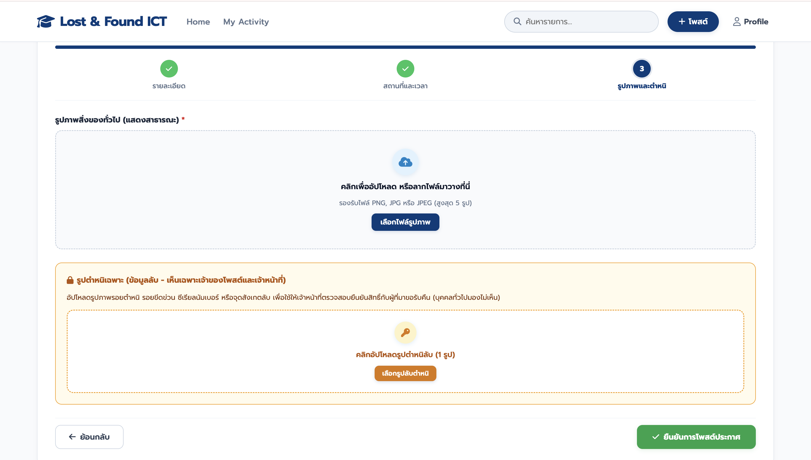

## 6. การแสดงผลรายการประกาศบนหน้าหลัก

หลังจากผู้ใช้งานดำเนินการสร้างประกาศและกดปุ่ม **ยืนยันการโพสต์ประกาศ** เรียบร้อยแล้ว ระบบจะบันทึกข้อมูลและแสดงประกาศดังกล่าวบนหน้าหลักของระบบในส่วน **รายการล่าสุด**

แต่ละรายการจะแสดงข้อมูลสำคัญของสิ่งของ ได้แก่

- รูปภาพสิ่งของ
- ชื่อสิ่งของ
- หมวดหมู่
- วันที่พบหรือวันที่แจ้งหาย
- สถานที่พบหรือสถานที่เกิดเหตุ
- สถานะของรายการ
- ปุ่ม **ดูรายละเอียด**

ผู้ใช้งานสามารถเรียกดูรายการประกาศล่าสุดของสมาชิกภายในระบบได้จากหน้าหลัก และเลือกดูข้อมูลเพิ่มเติมของแต่ละรายการได้โดยการกดปุ่ม **ดูรายละเอียด**

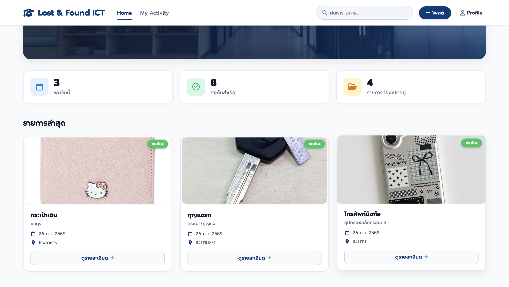

## 7 การดูรายละเอียดสิ่งของ

เมื่อผู้ใช้งานพบรายการที่ต้องการตรวจสอบ สามารถคลิกปุ่ม **ดูรายละเอียด** จากหน้ารายการประกาศ ระบบจะแสดงหน้ารายละเอียดสิ่งของเพื่อแสดงข้อมูลที่เกี่ยวข้องทั้งหมดของรายการนั้น

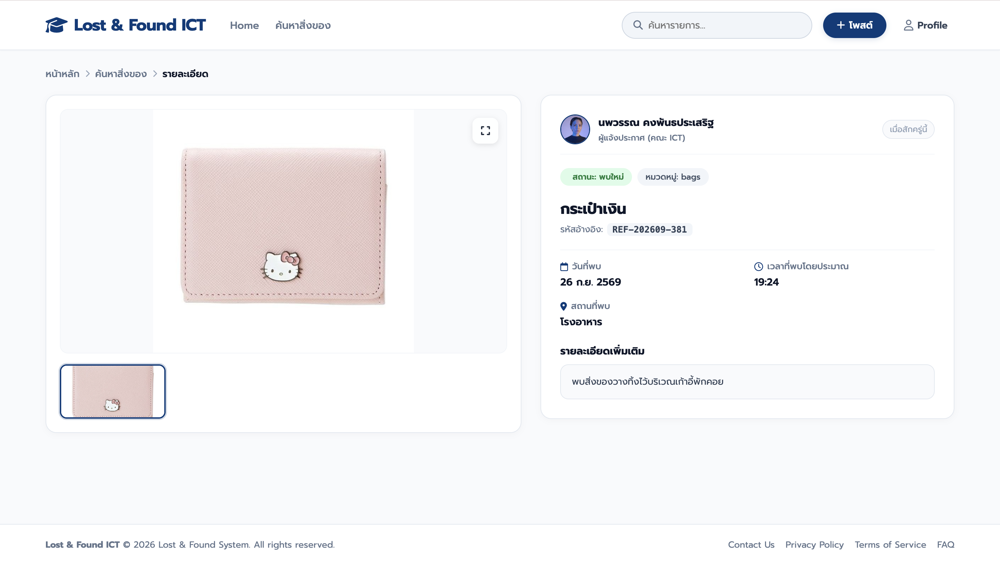

### ข้อมูลที่แสดงในหน้ารายละเอียด

ภายในหน้ารายละเอียดสิ่งของ ระบบจะแสดงข้อมูลสำคัญดังต่อไปนี้

- รูปภาพของสิ่งของ
- รูปภาพเพิ่มเติมของสิ่งของ (ถ้ามี)
- ชื่อสิ่งของ
- สถานะของรายการ เช่น พบใหม่ หรือตามหาเจ้าของ
- หมวดหมู่สิ่งของ
- รหัสอ้างอิงของรายการ (Reference ID)
- วันที่พบหรือวันที่แจ้งหาย
- เวลาที่เกิดเหตุหรือเวลาที่พบโดยประมาณ
- สถานที่พบหรือสถานที่สูญหาย
- รายละเอียดเพิ่มเติมเกี่ยวกับสิ่งของ
- ข้อมูลผู้แจ้งประกาศ

### การดูรูปภาพสิ่งของ

ผู้ใช้งานสามารถตรวจสอบรูปภาพของสิ่งของได้จากส่วนแสดงภาพด้านซ้ายของหน้าจอ โดยสามารถ

1. คลิกที่รูปภาพขนาดย่อ เพื่อเปลี่ยนภาพที่ต้องการดู
2. ดูภาพขนาดใหญ่เพื่อพิจารณารายละเอียดของสิ่งของ
3. ขยายรูปภาพเพื่อดูรายละเอียดเพิ่มเติม (หากระบบรองรับ)

การแสดงรูปภาพช่วยให้ผู้ใช้งานสามารถตรวจสอบลักษณะ สี รูปร่าง และรายละเอียดของสิ่งของได้อย่างชัดเจนมากยิ่งขึ้น

### การตรวจสอบข้อมูลประกาศ

ผู้ใช้งานควรตรวจสอบข้อมูลต่าง ๆ ที่แสดงในประกาศ เช่น

- ชื่อสิ่งของ
- สถานที่พบหรือสูญหาย
- วันที่และเวลา
- รายละเอียดเพิ่มเติม
- สถานะของรายการ

ข้อมูลดังกล่าวจะช่วยให้สามารถยืนยันได้ว่ารายการนั้นตรงกับสิ่งของที่กำลังค้นหาหรือไม่

## 8. การค้นหาสิ่งของ

เมื่อผู้ใช้งานเลือกเมนู **ค้นหาสิ่งของ** หรือทำการค้นหาจากแถบค้นหาด้านบน ระบบจะแสดงหน้ารายการสิ่งของพร้อมตัวกรองการค้นหา ดังรูป

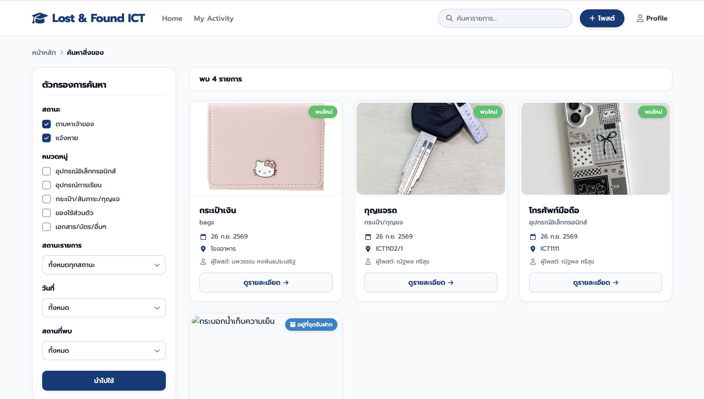

### การค้นหาด้วยคำค้น

1. คลิกที่ช่องค้นหาบริเวณด้านบนของหน้าจอ
2. กรอกชื่อสิ่งของ หรือคำสำคัญที่ต้องการค้นหา
3. กดปุ่ม Enter หรือปุ่มค้นหา
4. ระบบจะแสดงรายการที่ตรงหรือใกล้เคียงกับคำค้นที่ระบุ

ตัวอย่างคำค้นหา

- กระเป๋าเงิน
- กุญแจรถ
- โทรศัพท์มือถือ
- บัตรนักศึกษา

### การค้นหาด้วยตัวกรอง (Filter)

ผู้ใช้งานสามารถกำหนดเงื่อนไขเพิ่มเติมเพื่อจำกัดผลการค้นหาได้ โดยมีรายละเอียดดังนี้

**1. สถานะ**

เลือกประเภทของรายการที่ต้องการค้นหา เช่น

- ตามหาเจ้าของ
- แจ้งหาย

**2. หมวดหมู่**

เลือกหมวดหมู่ของสิ่งของที่ต้องการค้นหา เช่น

- อุปกรณ์อิเล็กทรอนิกส์
- อุปกรณ์การเรียน
- กระเป๋า/สัมภาระ/กุญแจ
- ของใช้ส่วนตัว
- เอกสาร/บัตร/อื่น ๆ

**3. สถานะรายการ**

เลือกสถานะของประกาศ เช่น

- ทั้งหมดทุกสถานะ
- เปิดรับการติดต่อ
- ส่งคืนสำเร็จแล้ว
- ปิดรายการ

**4. วันที่**

เลือกวันที่ที่ต้องการค้นหา เพื่อแสดงเฉพาะรายการที่เกี่ยวข้องกับวันดังกล่าว

**5. สถานที่พบ**

เลือกสถานที่พบหรือสถานที่เกิดเหตุ เพื่อช่วยจำกัดผลลัพธ์ให้ตรงกับพื้นที่ที่ผู้ใช้งานต้องการค้นหา

### การแสดงผลการค้นหา

หลังจากกำหนดเงื่อนไขและคลิกปุ่ม **นำไปใช้** ระบบจะแสดงรายการสิ่งของที่ตรงกับเงื่อนไขที่เลือกไว้

สำหรับแต่ละรายการจะแสดงข้อมูลสำคัญ ได้แก่

- รูปภาพสิ่งของ
- ชื่อสิ่งของ
- หมวดหมู่
- วันที่พบหรือวันที่แจ้งหาย
- สถานที่พบ
- ชื่อผู้โพสต์ประกาศ
- สถานะของรายการ
- ปุ่ม **รายละเอียด**

ผู้ใช้งานสามารถคลิกปุ่ม **รายละเอียด** เพื่อดูข้อมูลเพิ่มเติมของสิ่งของแต่ละรายการได้

## 9. การจัดการข้อมูลส่วนตัว

ผู้ใช้งานสามารถจัดการข้อมูลบัญชีผู้ใช้ของตนเองได้ผ่านเมนู **Profile** ที่อยู่บริเวณมุมขวาบนของหน้าจอ โดยระบบจะแสดงข้อมูลส่วนตัวและสถิติการใช้งานที่เกี่ยวข้องกับบัญชีของผู้ใช้งาน

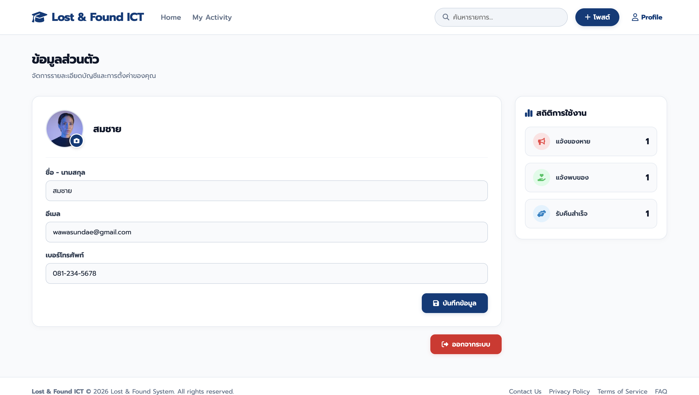

### ข้อมูลส่วนตัว

ภายในหน้าโปรไฟล์ ผู้ใช้งานสามารถตรวจสอบและแก้ไขข้อมูลส่วนตัวได้ ประกอบด้วย

- รูปโปรไฟล์
- ชื่อ - นามสกุล
- อีเมล
- เบอร์โทรศัพท์

ผู้ใช้งานสามารถแก้ไขข้อมูลที่ต้องการได้โดยตรงภายในแบบฟอร์มที่ระบบจัดเตรียมไว้

### การแก้ไขข้อมูลส่วนตัว

หากต้องการแก้ไขข้อมูลส่วนตัว ให้ดำเนินการดังนี้

1. เลือกเมนู **Profile**
2. แก้ไขข้อมูลที่ต้องการ เช่น
- ชื่อ - นามสกุล
- เบอร์โทรศัพท์
- รูปโปรไฟล์
3. ตรวจสอบความถูกต้องของข้อมูล
4. คลิกปุ่ม **บันทึกข้อมูล**
5. ระบบจะอัปเดตข้อมูลบัญชีผู้ใช้ตามที่แก้ไข

### สถิติการใช้งาน

บริเวณด้านขวาของหน้าโปรไฟล์ ระบบจะแสดงสถิติการใช้งานของผู้ใช้งาน ประกอบด้วย

- จำนวนรายการแจ้งของหาย
- จำนวนรายการแจ้งพบของ
- จำนวนรายการที่ส่งคืนสำเร็จ

ข้อมูลดังกล่าวช่วยให้ผู้ใช้งานสามารถตรวจสอบประวัติการใช้งานระบบของตนได้อย่างสะดวก

### การออกจากระบบ

หากผู้ใช้งานต้องการสิ้นสุดการใช้งานระบบ สามารถคลิกปุ่ม **ออกจากระบบ** ที่ด้านล่างของหน้าโปรไฟล์

เมื่อกดปุ่มออกจากระบบ ระบบจะยุติการเข้าสู่ระบบของผู้ใช้งานและนำกลับไปยังหน้าเข้าสู่ระบบ เพื่อป้องกันการเข้าถึงข้อมูลจากบุคคลอื่น

### หมายเหตุ

ผู้ใช้งานควรตรวจสอบความถูกต้องของข้อมูลส่วนตัวให้เป็นปัจจุบันอยู่เสมอ โดยเฉพาะอีเมลและเบอร์โทรศัพท์ เพื่อให้สามารถติดต่อประสานงานหรือยืนยันความเป็นเจ้าของสิ่งของได้อย่างถูกต้องและรวดเร็ว
